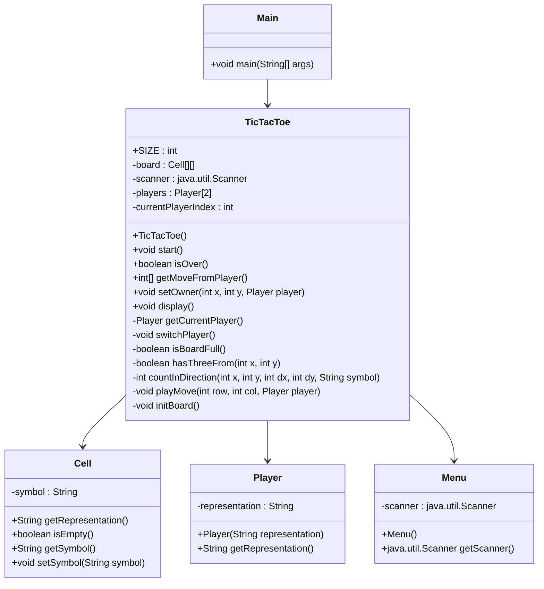

# Diagramme

```mermaid
classDiagram
    class Main {
        +void main(String[] args)
    }

    class TicTacToe {
        +SIZE : int
        -board : Cell[][]
        -scanner : java.util.Scanner
        -players : Player[2]
        -currentPlayerIndex : int

        +TicTacToe()
        +void start()
        +boolean isOver()
        +int[] getMoveFromPlayer()
        +void setOwner(int x, int y, Player player)
        +void display()

        -Player getCurrentPlayer()
        -void switchPlayer()
        -boolean isBoardFull()
        -boolean hasThreeFrom(int x, int y)
        -int countInDirection(int x, int y, int dx, int dy, String symbol)
        -void playMove(int row, int col, Player player)
        -void initBoard()
    }

    class Menu {
        -scanner : java.util.Scanner
        +Menu()
        +java.util.Scanner getScanner()
    }

    class Cell {
        -symbol : String
        +String getRepresentation()
        +boolean isEmpty()
        +String getSymbol()
        +void setSymbol(String symbol)
    }

    class Player {
        -representation : String
        +Player(String representation)
        +String getRepresentation()
    }

%% Relations
    Main --> TicTacToe
    TicTacToe --> Cell
    TicTacToe -->  Player
    TicTacToe --> Menu


```

