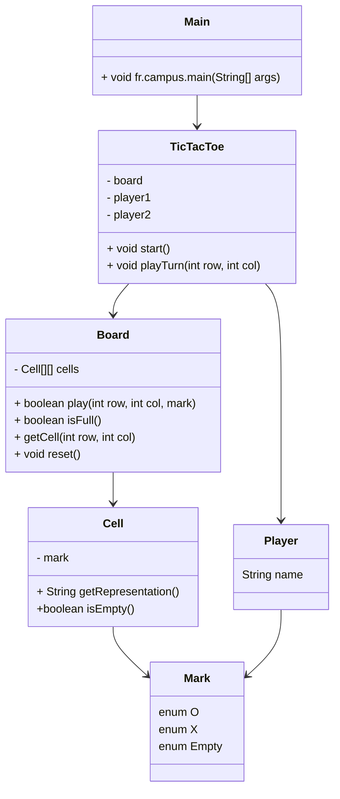

# Diagramme

```mermaid
classDiagram
Main : + void fr.campus.main(String[] args)

    class TicTacToe {
      - board
      - player1
      - player2
      
      + void start()
      + void playTurn(int row, int col)
      
    }
    class Board {
      - Cell[][] cells
      + boolean play(int row, int col, mark)                                                                                                                                                                          
      + boolean isFull()
      + getCell(int row, int col)
      + void reset()
    }

    class Cell {
        - mark
        + String getRepresentation()
        +boolean isEmpty ()

    }

    class Player {
            String name
        }

    class Mark {
        enum O 
        enum X
        enum Empty
    }

 Main --> TicTacToe
 TicTacToe --> Board
 Board      --> Cell
 TicTacToe --> Player
 Cell --> Mark
 Player --> Mark


```

