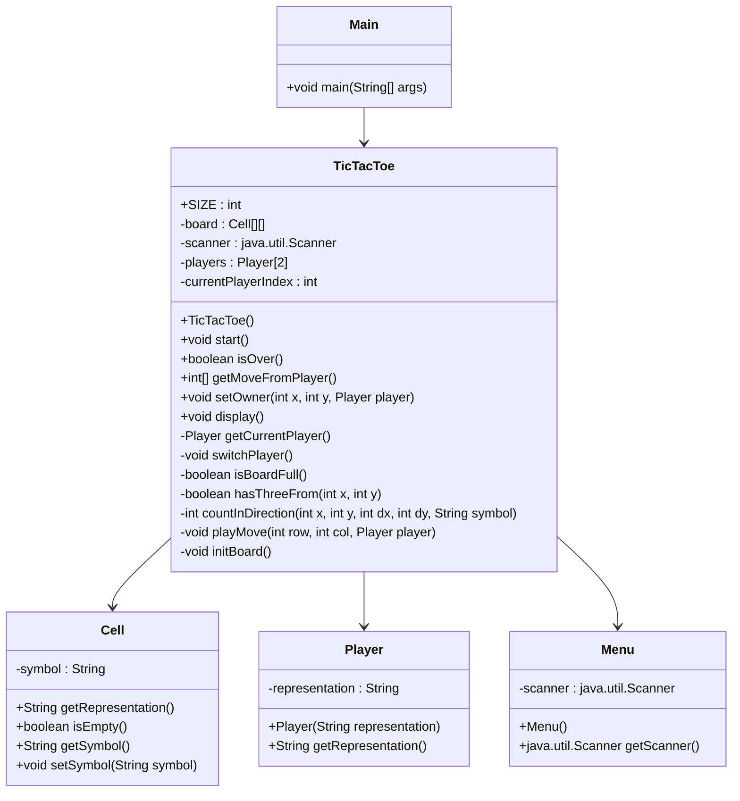

# Diagramme


Architecture MVC N°1

```mermaid
classDiagram


class TicTacToeController {
  
  -board : Cell[][]
  -player1 : Player
  -player2 : Player  
  -InterractionUtilisateur : interractionutilisateur
  -currentplayer : Player

  +void start()
  -void play()
  -void switchPlayer()
  -boolean isValidCoor()
  
}

class ViewConsole {
      

  +void displayMessage(String message)
  +void displayboard(Board)
  

}

class Cell {
  -representation : String
  

  +String getRepresentation()
  +boolean isEmpty()
  +void setRepresentation(String representation)


}

class Board {
    -board : Cell [][]
    -size int

    +boolean isOver()
    -boolean isWin()
    -boolean isFull()
    -void initBoard()
    +boolean checkAlignement()
    +int getSize()
    +void setOwner(int coorX,int coorY, Player player)


}

class InterractionUtilisateur {
    -Scanner : scanner

    +askInt()

}

class Player {
    <<Abstract>>
  -representation : String
  
  +String getRepresentation()
}

class ArtificialPlayer{
    -Random random

    int getRandom()

    
}

class RealPlayer {
    
}

%% Relation


ArtificialPlayer --|> Player
RealPlayer  --|> Player


Board"1"*--"1.."Cell
TicTacToeController"1"*--"1"Board
TicTacToeController "1" o-- "2" Player
TicTacToeController "1" o-- "1" InterractionUtilisateur
TicTacToeController "1" o-- "1" ViewConsole
 ```

Architecture MVC N°2
```mermaid

classDiagram


class TicTacToeController {

    -tictactoeview : TicTacToeView
    -tictactoemodel : TicTactoeModel
  
  +void start()
  -void play()
  -void switchPlayer()
  -boolean isValidCoor()
  
}

class ViewConsole {
      

  +void displayMessage(String message)
  +void displayboard(Board)
  

}

class Cell {
  -representation : String
  

  +String getRepresentation()
  +boolean isEmpty()
  +void setRepresentation(String representation)


}

class TicTacToeView {

-interractionutilisateur : InterractionUtilisateur
-viewconsole : ViewConsole
}

class TicTactoeModel {

  -board : Cell[][]
  -player1 : Player
  -player2 : Player  
  -currentplayer : Player

    
}

class Board {
    -board : Cell [][]
    -size int

    +boolean isOver()
    -boolean isWin()
    -boolean isFull()
    -void initBoard()
    +boolean checkAlignement()
    +int getSize()
    +void setOwner(int coorX,int coorY, Player player)


}

class InterractionUtilisateur {
    -Scanner : scanner

    +askInt()

}

class Player {
    <<Abstract>>
  -representation : String
  
  +String getRepresentation()
}

class ArtificialPlayer{
    -Random random

    int getRandom()

    
}

class RealPlayer {
    
}

%% Relation


ArtificialPlayer --|> Player
RealPlayer  --|> Player


Board"1"*--"1.."Cell
TicTactoeModel"1"*--"1"Board
TicTactoeModel "1" o-- "2" Player
TicTacToeView "1" o-- "1" InterractionUtilisateur
TicTacToeView "1" o-- "1" ViewConsole
TicTacToeController "1" o-- "1" TicTacToeView
TicTacToeController "1" o-- "1" TicTactoeModel


```


